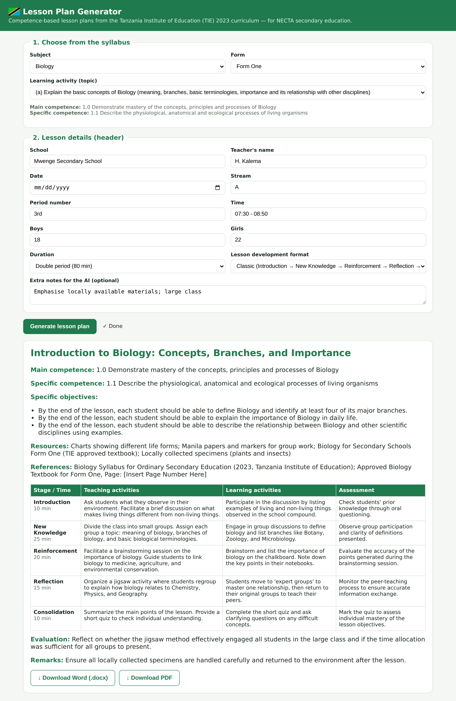

# Tanzania Lesson Plan Generator (NECTA / TIE 2023)

An AI-assisted web app that produces competence-based lesson plans for Tanzanian
secondary education, grounded in the **Tanzania Institute of Education (TIE) 2023
revised curriculum**. Teachers pick a subject, form, and a real syllabus learning
activity; the AI (Google Gemini) expands it into a full classroom-ready plan that they can preview
and download as **Word (.docx)** or **PDF**.



## Why it's grounded, not invented

The curriculum content is stored as structured data in `data/syllabus/*.json`,
extracted from the official TIE syllabus PDFs. Each learning activity carries its
real **main competence**, **specific competence**, suggested methods, assessment
criteria, and resources. The model is instructed to copy the competence statements
verbatim and build the lesson only from the selected activity, so the plans cite
the actual syllabus rather than the model's general (and possibly outdated)
knowledge.

## Subject coverage

The app advertises all 18 subjects (`data/registry.json`). Each shows a status:

- **ready** — has structured syllabus data and can generate plans now.
  Currently: **Biology, Form One** (9 activities, hand-transcribed from the PDF).
- **pdf** — the official 2023 TIE PDF is downloaded in `data/pdfs/` and can be
  turned into data with one command (see *Populating subjects* below).
  Currently 13: **Chemistry, Physics, Mathematics, Geography, History,
  Computer Science, Kiswahili, English Language, Literature in English,
  Business Studies, Bible Knowledge, Historia ya Tanzania na Maadili,
  Elimu ya Dini ya Kiislamu**. (Literature is a Form III–IV subject, so its
  data only covers those two forms — that is correct, not a gap.)
- **pending** — no usable 2023 PDF found. Currently 4: **Arabic** (TIE's own
  publications-page link 404s — broken on their server), **Civics** (not
  published standalone in 2023; its content was folded into *Historia ya
  Tanzania na Maadili*, which is covered), **French** and **Chinese** (no 2023
  `sw-*` document posted yet). See `data/sources.json` → `unavailable` for notes.

Non-ready subjects appear in the dropdown (disabled) so teachers see what's coming.

## Populating subjects (ingestion)

`scripts/ingest_syllabus.py` turns a downloaded TIE PDF into structured JSON,
**grounded in the real document**: it extracts the PDF text, slices it per Form,
and asks the model to *transcribe* (not invent) each learning-activity row of the
syllabus matrix into the schema. Because the model only ever sees the real
syllabus text and is told to copy verbatim, the output is a faithful
transcription.

```bash
export GEMINI_API_KEY=...
python scripts/ingest_syllabus.py Chemistry     # one subject
python scripts/ingest_syllabus.py --all         # every downloaded PDF
```

After ingestion the new `data/syllabus/<subject>.json` makes that subject "ready"
in the UI automatically. Always spot-check the generated JSON against the PDF —
the Form-splitter is best-effort and a few subjects (e.g. Physics, Islamic
Education) have PDF-extraction quirks that may drop or thin a Form section.

To add a subject that's still **pending**: find its `tie.go.tz/uploads/documents/sw-...`
PDF URL, add it to `data/sources.json`, run the download step, then ingest.

## Run

```bash
export GEMINI_API_KEY=...   # free key: https://aistudio.google.com/apikey
./run.sh                                  # http://localhost:8000
```

Or manually:

```bash
python3 -m venv .venv && .venv/bin/pip install -r requirements.txt
.venv/bin/uvicorn app.main:app --reload
```

Without a key, the browsing/preview UI still loads and exports work, but
**Generate** returns a 502 telling you to set `GEMINI_API_KEY`.

## Lesson development formats

- **Classic** — Introduction → New Knowledge → Reinforcement → Reflection → Consolidation
- **TIE 2023** — Introduction → Competence Development → Design → Realisation

## Architecture

| File | Role |
|------|------|
| `app/syllabus.py` | Loads structured TIE syllabus JSON |
| `app/llm.py` | Single point where the app calls the LLM (Google Gemini)
| `app/generator.py` | Builds the grounded prompt and calls `llm.structured()` |
| `app/exporters.py` | Renders the plan to `.docx` (python-docx) and `.pdf` (reportlab) |
| `app/main.py` | FastAPI endpoints + serves the single-page UI |
| `app/static/index.html` | Teacher-facing form and live preview |
| `data/syllabus/*.json` | Structured curriculum data (ground truth) |
| `scripts/` | Helpers for extracting more syllabi from TIE PDFs |

## Model

Uses **Google Gemini** (`gemini-2.5-flash`, free tier) with structured outputs
so the response always matches the lesson-plan schema. The provider lives in one
file, `app/llm.py` — change the model via `LESSONPLAN_MODEL`, or swap providers
there without touching the rest of the app.

## Extending the syllabus

1. Download the subject PDF from tie.go.tz into `data/pdfs/`.
2. Extract the competence matrix (Table 3–6) — `scripts/extract_pdf_text.py`
   dumps the text; transcribe each row into the JSON shape in `biology.json`.
3. Drop the new JSON in `data/syllabus/`. It appears in the UI automatically.
