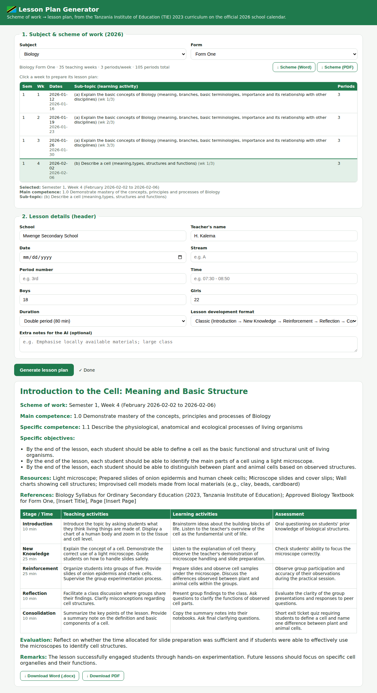

# Tanzania Lesson Plan Generator (NECTA / TIE 2023)

An AI-assisted web app that produces competence-based lesson plans for Tanzanian
schools — pre-primary, primary and secondary — grounded in the **Tanzania
Institute of Education (TIE) 2023 revised curriculum**. It follows the real teaching workflow: the syllabus is laid
out as a **2026 scheme of work** (weeks and dates on the official school calendar),
the teacher picks a week, and the AI (Google Gemini) expands that week's sub-topic
into a full classroom-ready lesson plan — previewable and downloadable as
**Word (.docx)** or **PDF**. The scheme of work itself is also exportable.



## Getting started

**Prerequisites:** Python 3.10+ and a free Google Gemini API key.

```bash
# 1. Clone
git clone https://github.com/AnzuShiddy/necta-lesson-plan-generator.git
cd necta-lesson-plan-generator

# 2. Get a free Gemini key at https://aistudio.google.com/apikey, then:
export GEMINI_API_KEY=your-key-here

# 3. Install dependencies and start the app
python3 -m venv .venv
.venv/bin/pip install -r requirements.txt
./run.sh
```

Open **http://localhost:8000**, pick a subject → form → learning activity, fill in
the lesson header, and click **Generate lesson plan**. Preview it in the browser,
then download it as **Word (.docx)** or **PDF**.

> The 65 subject/level combinations with syllabus data (see below) work out of
> the box — pre-primary, all of primary, all 30 Form V–VI subjects and 14 of the
> Form I–IV ones, 2,624 learning activities in all. Without a
> `GEMINI_API_KEY` the browsing UI still loads and exports work, but **Generate**
> returns an error asking you to set the key. On Google's free tier, per-model
> daily request limits are small — if generation is rate-limited, wait and retry
> or set a different model via `LESSONPLAN_MODEL` (see *Model* below).

## Scheme of work → lesson plan

In Tanzanian practice a lesson plan is drawn from the **scheme of work (azimio la
kazi)** — the syllabus distributed across the year's teaching weeks. The app builds
that scheme **deterministically and grounded**, with no AI and no scraping:

- **competences, activities, methods, assessment** come from the syllabus data;
- **periods per topic** come from the syllabus's own `periods_for_specific_competence`;
- **weeks and dates** come from the academic calendar for that form's level
  (`app/calendars.py`), picked from the form name:
  - **Awali, Grade 1–6 and Form I–IV, 2026** — the official MoEST calendar,
    issued for pre-primary, primary and secondary together. Sem 1: 13 Jan–5 Jun,
    break 27 Mar–8 Apr; Sem 2: 6 Jul–4 Dec, break 4 Sep–14 Sep; 37 teaching
    weeks.
  - **Form V–VI, 2026/2027** — the A-level year runs July to May, so it spans
    two calendar years. Sem 1 (6 Jul–4 Dec 2026) is the official MoEST block,
    matching Form V reporting on 4 July 2026. Sem 2 runs into 2027 and is
    **inferred** from the 2026 pattern, ending before the ACSEE examinations;
    it is flagged `provisional` and the UI says so. Replace it with the
    published 2026/2027 almanac and drop the flag.

Periods-per-week is *derived* (total syllabus periods ÷ that year's teaching weeks), not
guessed, and multi-week topics span consecutive weeks. The generated schemes are
materialised in `data/schemes/*.json` (via `scripts/build_schemes.py`) and are also
exportable to Word/PDF. Then the lesson plan flows from a chosen week, inheriting
its week number, dates and sub-topic.

> Third-party 2026 scheme files (wazaelimu, elimuchap, …) are paywalled or gated,
> and are themselves just the syllabus on the calendar — so generating gives the
> same result, complete for all subjects and consistent with the plans.

## Why it's grounded, not invented

The curriculum content is stored as structured data in `data/syllabus/*.json`,
extracted from the official TIE syllabus PDFs. Each learning activity carries its
real **main competence**, **specific competence**, suggested methods, assessment
criteria, and resources. The model is instructed to copy the competence statements
verbatim and build the lesson only from the selected activity, so the plans cite
the actual syllabus rather than the model's general (and possibly outdated)
knowledge.

## Subject coverage

Subjects are advertised per **level** (`data/registry.json`), because the levels
are different syllabuses, taught over different years:

| Level | Forms | School year | Subjects | Ready | Activities |
|---|---|---|---|---|---|
| Pre-primary | Awali | 2026 | 6 | 6 | 90 |
| Primary | Grade 1–6 | 2026 | 15 | 15 | 691 |
| Ordinary | Form I–IV | 2026 | 18 | 14 | 855 |
| Advanced | Form V–VI | 2026/2027 | 30 | 30 | 988 |

Pick the level in the UI, then the **class**, and the subject list narrows to
what that class actually studies — Afya na Mazingira is a Grade 1-2 subject,
Literature in English a Form III-IV one, so neither clutters a class that does
not take it. Subjects with no syllabus data yet are always listed (disabled), so
teachers can still see what is coming. A subject
taught at several levels (English, Kiswahili, Biology, …) keeps one syllabus
document per level — `english.json`, `english_primary.json`,
`english_language_advanced.json` — since TIE publishes them separately. The form
name implies the level everywhere else, so nothing downstream has to carry it
around.

### Pre-primary (Awali) and primary (Grade 1–6)

Pre-primary and primary sit on the **same MoEST 2026 calendar** as Form I–IV —
one almanac covers all three. The 2023 curriculum makes primary six years, so
there is no Grade 7.

TIE publishes these two levels differently from secondary, and the ingestion
handles both shapes:

- **Grade 3–6** — one document per subject, `Standard III–VI`, split by grade
  exactly like the secondary syllabuses. 10 subjects: Kiswahili, English,
  Hisabati / Mathematics, Sayansi / Science, Jiografia na Mazingira, Historia ya
  Tanzania na Maadili, Sanaa na Michezo, French, Arabic, Chinese.
- **Pre-primary and Grade 1–2** — a *single* document holds the whole band, and
  it is organised by main competence rather than by subject. Each numbered main
  competence **is** a subject, so every activity is filed under the subject its
  competence number names. The two maps live in `COMBINED_DOCS` in
  `scripts/ingest_syllabus.py`, read straight off each document's own competence
  table (Jedwali Na. 1 / Na. 1.2) and cited line by line, so the split stays
  grounded in the source rather than in the model's judgement:

  | Awali — Jedwali Na. 1.2 | Subject |
  |---|---|
  | 1.0 Kumudu stadi za kisanii, ubunifu na michezo | Creative Arts and Sports |
  | 2.0 Kuthamini utamaduni … na tunu za taifa | Naipenda Nchi Yangu Tanzania |
  | 3.0 Kumudu stadi za awali za lugha ya mawasiliano | Early Literacy Skills |
  | 4.0 Kuhusiana | Early Life Skills |
  | 5.0 Kutunza afya na mazingira | Health and Environment |
  | 6.0 Kutumia stadi za awali za kihisabati, sayansi na TEHAMA | Arithmetic, Science and ICT |

  Grade 1–2 maps the same way onto Kusoma / Reading, Kuandika / Writing,
  English, Kuhesabu / Arithmetic, Utamaduni Sanaa na Michezo, and Afya na
  Mazingira.

  That document has **no Kiswahili competence**: it states that Kiswahili is the
  *language of instruction* at Standard I–II (*"kwa kutumia Kiswahili kama lugha
  ya kufundishia"*) and that its literacy work is Kusoma and Kuandika. Schools
  timetable that period as Kiswahili, so the subject is also offered under that
  name, carrying exactly those two competences' rows and nothing else — see
  `aggregates` in `COMBINED_DOCS`. Kiswahili therefore runs Grade 1–6: Grade 1–2
  from the combined document, Grade 3–6 from its own.

Ingest them with:

```bash
python scripts/download_syllabus_pdfs.py --all --level primary
python scripts/ingest_syllabus.py --all --level primary   # combined doc first
python scripts/ingest_syllabus.py --combined awali        # pre-primary
```

A subject can be split across two documents — English is in both the combined
Grade 1–2 syllabus and its own Grade 3–6 one — so ingesting either **keeps** the
other's grades rather than overwriting them.

A pre-primary session is **20 minutes** (Mtaala wa Elimu ya Awali, Jedwali Na.
1.5), not the 40-minute period used everywhere else, and the generator is told
to keep every stage play-based, oral and concrete for that age.

#### Medium of instruction

TIE publishes the pre-primary and primary syllabuses **in Kiswahili only**.
English versions exist historically (*Science Syllabus For Primary Education
Standard III–VI*, *Syllabus for English Language STD III–VII ENGLISH MEDIUM
SCHOOLS*) but every one of them 404s — TIE's whole `uploads/files/` tree is gone,
the same failure recorded for O-level Arabic. English-medium schools nonetheless
teach that identical curriculum in English, so the app offers a **medium of
instruction** choice on these two levels (and only these two — secondary is
already English-medium apart from its Kiswahili-taught subjects, which the app
handles per subject):

- **Kiswahili medium** — the whole plan is written in Kiswahili and the
  competence statements are copied **verbatim** from the syllabus, as everywhere
  else in the app.
- **English medium** — the whole plan **and the scheme of work** are in English.
  The scheme is still built deterministically with no model call: the syllabus
  data is translated **once**, offline, by `scripts/translate_syllabus.py`, and
  stored beside the source as `data/syllabus/<slug>.en.json`. The Kiswahili file
  is never modified — it stays the verbatim transcription — and choosing a medium
  simply picks which file the scheme is built from. Rows are matched back by
  activity `id`, so a row the model drops keeps its original Kiswahili rather
  than disappearing. The lesson plan's competence statements and learning
  activity are likewise rendered in English. Both exports then carry a line
  saying so:

  > *Note: this school is English-medium. The competence statements above are an
  > English translation of the Kiswahili TIE syllabus, not its wording.*

  and on the scheme of work:

  > *Note: this scheme is for an English-medium school. TIE publishes this
  > syllabus in Kiswahili; the rows below are an English translation of it, not
  > TIE's own wording.*

  Two subjects need care and got it. The **English** syllabus is already in
  English, so the pass copies it through unchanged — identical output is correct
  there, not a failure. **Arabic** and **Chinese** are bilingual (their script
  beside the Kiswahili) and the first pass kept the Kiswahili; they were re-run
  with an instruction covering mixed-script sources. **Kiswahili** keeps the
  Kiswahili words it teaches (*kuliko*, *zaidi ya*) inside English sentences,
  which is right.

  That line is not decoration. Everywhere else a competence is verbatim syllabus
  text, and a reader — including an inspector — has no other way to tell the
  difference, so an English-medium plan says it plainly.

The **References** citation stays in Kiswahili even for an English-medium plan,
because it names a real published book (*TET, … Kitabu cha Mwanafunzi na
Kiongozi cha Mwalimu*). Translating a title would misname the work the teacher
is meant to pick up.

### Ordinary level (Form I–IV)

Each subject shows a status:

- **ready** — has structured syllabus data and can generate plans now.
  Currently **14 subjects, 769 learning activities** across Forms I–IV: Biology,
  Chemistry, Physics, Mathematics, Geography, History, Computer Science,
  Kiswahili, English Language, Literature in English, Business Studies,
  Bible Knowledge, Historia ya Tanzania na Maadili, Elimu ya Dini ya Kiislamu.
  (Literature is a Form III–IV subject, so its data covers only those two
  forms — that is correct, not a gap.) All were transcribed verbatim from the
  official TIE PDFs via `scripts/ingest_syllabus.py`.
- **pending** — no usable 2023 PDF found. Currently 4: **Arabic** (TIE's own
  publications-page link 404s — broken on their server), **Civics** (not
  published standalone in 2023; its content was folded into *Historia ya
  Tanzania na Maadili*, which is covered), **French** and **Chinese** (no 2023
  `sw-*` document posted yet). See `data/sources.json` → `unavailable` for notes.

Non-ready subjects appear in the dropdown (disabled) so teachers see what's coming.

### Advanced level (Form V–VI)

Every subject TIE publishes a Form V–VI syllabus for — **30 subjects, 988
learning activities**, all ready. Each was transcribed verbatim from the
official TIE *Advanced Secondary Education Form V–VI* PDF; every URL was fetched
and its title page checked to name both the subject and Form V–VI before being
added to `data/sources.json`.

| Subject | Form V | Form VI |
|---|---|---|
| Kiswahili | 48 | 38 |
| English Language | 37 | 28 |
| Literature in English | 35 | 26 |
| Fasihi ya Kiswahili | 32 | 24 |
| Historia ya Tanzania na Maadili | 30 | 25 |
| Computer Science | 27 | 25 |
| Elimu ya Dini ya Kiislamu | 27 | 19 |
| History | 28 | 17 |
| Tourism | 25 | 12 |
| Chinese | 18 | 17 |
| French | 18 | 16 |
| Academic Communication | 18 | 15 |
| Accountancy | 20 | 12 |
| Chemistry | 19 | 12 |
| Arabic | 13 | 16 |
| Biology | 16 | 12 |
| Advanced Mathematics | 14 | 12 |
| Food and Nutrition | 14 | 11 |
| Theatre Arts | 17 | 8 |
| Divinity | 11 | 13 |
| Physics | 12 | 10 |
| Economics | 11 | 10 |
| Fine Art | 10 | 8 |
| Music | 9 | 9 |
| Sport Studies | 10 | 7 |
| Textiles and Garment Construction | 9 | 6 |
| Basic Applied Mathematics | 8 | 6 |
| Agriculture | 5 | 8 |
| Geography | 7 | 6 |
| Business Studies | 6 | 6 |

To add a subject TIE publishes later: find its `tie.go.tz` PDF, confirm the
title page reads *SYLLABUS FOR ADVANCED SECONDARY EDUCATION FORM V–VI*, add it
under `levels.advanced.subjects` in `data/sources.json`, then:

```bash
python scripts/download_syllabus_pdfs.py --all --level advanced
python scripts/ingest_syllabus.py "Sport Studies" --level advanced
```

**Known gap:** in *Textiles and Garment Construction* Form V, 6 of 9 rows carry
no main competence. Those cells are absent from the PDF's extracted text — the
transcription is faithful to what the document yields, and the gap is left
visible rather than filled with invented competences. Every other form across
both levels is complete (6 of 1,843 activities affected).

A-level PDFs and JSON carry an `_advanced` suffix so a subject taught at both
levels never overwrites its other document.

## Populating subjects (ingestion)

`scripts/ingest_syllabus.py` turns a downloaded TIE PDF into structured JSON,
**grounded in the real document**: it extracts the PDF text, slices it per Form,
and asks the model to *transcribe* (not invent) each learning-activity row of the
syllabus matrix into the schema. Because the model only ever sees the real
syllabus text and is told to copy verbatim, the output is a faithful
transcription.

The PDFs themselves are gitignored, so fetch them first — `data/sources.json`
holds the official TIE URLs:

```bash
python scripts/download_syllabus_pdfs.py --all   # or: ... Geography History
```

```bash
export GEMINI_API_KEY=...
python scripts/ingest_syllabus.py Chemistry     # one subject
python scripts/ingest_syllabus.py --all         # every downloaded PDF
```

Every subject already has a JSON file, so re-ingesting needs `--force`. Forms
built from a teacher scheme of work are preserved either way.

### Ingesting without a local API key

`.github/workflows/ingest-syllabus.yml` runs the same pipeline on GitHub
Actions using the `GEMINI_API_KEY` repository secret, and opens a pull request
with the regenerated data. Trigger it from **Actions → Ingest TIE syllabus →
Run workflow**, picking a subject. It is `workflow_dispatch` only — ingestion
is model-based and must never fire on push.

Requires **Settings → Actions → General → Workflow permissions → "Allow GitHub
Actions to create and approve pull requests"**, otherwise the PR step fails.

After ingestion the new `data/syllabus/<subject>.json` makes that subject "ready"
in the UI automatically. Always spot-check the generated JSON against the PDF —
the Form-splitter is best-effort and a few subjects (e.g. Physics, Islamic
Education) have PDF-extraction quirks that may drop or thin a Form section.

To add a subject that's still **pending**: find its `tie.go.tz/uploads/documents/sw-...`
PDF URL, add it to `data/sources.json`, run the download step, then ingest.

### Ingesting a real teacher scheme of work

A few forms are built from schemes actually used in class rather than from the
TIE syllabus transcription, which gives them topic-level detail and the
teacher's own month/week pacing. Drop the source document in `data/reference/`
(the documents stay local — as does the parsed text of any third-party one, since
that text *is* the document; the rebuilt output is committed either way), then:

```bash
python scripts/ingest_scheme_docs.py          # documents  -> data/reference/parsed/
python scripts/build_syllabus_from_schemes.py # parsed     -> data/syllabus/
python scripts/build_schemes.py               # syllabus   -> data/schemes/
```

Both source layouts are handled: the TIE competence-based layout, and the older
topic-based one (`MAIN-TOPIC` / `SUB-TOPIC`). No model call is involved — parsing
is deterministic. Activities from these forms carry three extra fields
(`periods`, `scheduled_month`, `scheduled_weeks`); `app/scheme.py` honours that
pacing instead of spreading periods evenly, and any form without them keeps the
original even-distribution behaviour. Currently applied to Biology Form One and
Three, and Chemistry Form Two and Three.

Re-ingesting a subject with `ingest_syllabus.py` **will not** overwrite a form
that was built this way — forms carrying a `source` block are kept as they are.

### Calendar milestones

Every teacher-authored scheme carries test and examination rows beside the
teaching rows, always in the same places. `Calendar.milestones()` derives
them from the semester dates rather than hard-coding them:

| Milestone | When |
|---|---|
| `MIDTERM TEST` | last teaching week before each mid-term break |
| `TERMINAL EXAMINATIONS` | last teaching week of semester 1 |
| `REVISION` | second-to-last teaching week of semester 2 |
| `ANNUAL EXAMINATIONS` | last teaching week of semester 2 |

Schemes get these automatically, tagged `kind: "assessment"` and carrying zero
teaching periods so they never inflate the period totals. A form whose source
document already supplies its own milestone rows keeps those instead, at the
weeks the teacher chose.

## Run

```bash
export GEMINI_API_KEY=...   # free key: https://aistudio.google.com/apikey
./run.sh                                  # http://localhost:8000
```

Or manually:

```bash
python3 -m venv .venv && .venv/bin/pip install -r requirements.txt
.venv/bin/uvicorn app.main:app --reload
```

Without a key, the browsing/preview UI still loads and exports work, but
**Generate** returns a 502 telling you to set `GEMINI_API_KEY`.

## Lesson plan formats

The format picked in the form changes both the lesson stages and the page layout
of the Word/PDF export.

- **Classic** — Introduction → New Knowledge → Reinforcement → Reflection →
  Consolidation, on the school-file page: a `LESSON PLAN` title, school and
  teacher lines, and the scheme-of-work week printed as a reference.
- **TIE 2023 booklet form** — Introduction → Competence Development → Design →
  Realisation, laid out as a facsimile of the pre-printed TIE lesson plan
  booklet page:

  ```
  Subject: ................        Class: ..............
  Date: ...................        Time: ...............
  Main Competence: ...........................................

              ┌───────────── Number of students ─────────────┐
              │     Registered      │        Present         │
              │ Girls │ Boys │ Total│ Girls │ Boys │ Total    │

  Specific Competence: .......................................
  Main Activity: .............................................
  Specific Activities: .......................................
  Teaching and Learning Resources: ...........................
  References: ................................................

                  Teaching and Learning Process
  ┌────────────┬───────────┬────────────┬────────────┬────────────┐
  │   Stages   │   Time    │  Teaching  │  Learning  │ Assessment │
  │            │ (Minutes) │ Activities │ Activities │  Criteria  │
  ├────────────┼───────────┼────────────┼────────────┼────────────┤
  │ Introduction / Competence Development / Design / Realisation  │
  └────────────┴───────────┴────────────┴────────────┴────────────┘

  Remarks: ...................................................
  ```

  The booklet page has no title and no school/teacher lines, so the export
  omits them too. Fields the teacher left blank print as dotted leaders to be
  filled in by hand.

Three parts of the form are deliberately never generated, because they record
what happened rather than what is planned:

- the *Present* half of the students table — attendance is taken on the day;
- **Remarks** — written after teaching. An LLM asked to fill it in will happily
  write "the lesson was successfully conducted with full participation of all
  47 students" for a lesson nobody has taught yet, which is a false claim in a
  document that goes to inspection;
- the pages/volume in **References**, which print as `pp. ___`.

A plan for a double period fits one A4 page. Longer ones flow onto a second
page with the table header repeated.

## Architecture

| File | Role |
|------|------|
| `app/syllabus.py` | Loads structured TIE syllabus JSON |
| `app/calendars.py` | Term dates per level (2026 for Form I–IV, 2026/2027 for Form V–VI) → ordered teaching weeks |
| `app/scheme.py` | Builds the scheme of work from syllabus + the level's calendar |
| `app/llm.py` | Single point where the app calls the LLM (Google Gemini) |
| `app/generator.py` | Builds the grounded prompt (from a scheme week) and calls `llm.structured()` |
| `app/exporters.py` | Renders lesson plans and schemes to `.docx` / `.pdf` |
| `app/main.py` | FastAPI endpoints + serves the single-page UI |
| `app/static/index.html` | Teacher-facing scheme table + lesson preview |
| `data/syllabus/*.json` | Structured curriculum data (ground truth) |
| `data/schemes/*.json` | Generated 2026 schemes of work (via `scripts/build_schemes.py`) |
| `scripts/` | PDF ingestion + scheme generation helpers |

## Model

Uses **Google Gemini** (default `gemini-flash-lite-latest`, free tier) with
structured outputs so the response always matches the lesson-plan schema. The
provider lives in one file, `app/llm.py` — change the model via the
`LESSONPLAN_MODEL` environment variable (e.g. a stronger model on a paid tier for
higher-quality plans), or swap providers there without touching the rest of the
app.

## Extending the syllabus

1. Download the subject PDF from tie.go.tz into `data/pdfs/`.
2. Extract the competence matrix (Table 3–6) — `scripts/extract_pdf_text.py`
   dumps the text; transcribe each row into the JSON shape in `biology.json`.
3. Drop the new JSON in `data/syllabus/`. It appears in the UI automatically.
